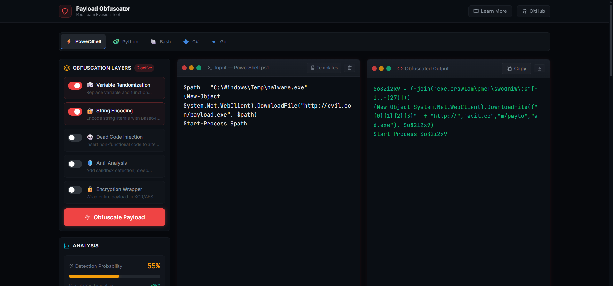

# 🛡️ Payload Obfuscator — Red Team Evasion & AV Bypass Tool

A **free, open-source, browser-based** payload obfuscation tool designed for red team operators, penetration testers, and security researchers. Supports **multi-layer obfuscation** across 5 languages with real-time **entropy analysis** and **detection scoring**.

> ⚠️ **For educational and authorized security testing purposes only.**



## ✨ Features

- **5 Languages**: PowerShell, Python, Bash, C#, Go
- **5 Obfuscation Layers** (stackable):
  - 🎲 Variable Randomization
  - 🔐 String Encoding (Base64, Hex, XOR, char codes)
  - 💀 Dead Code Injection
  - 🛡️ Anti-Analysis (sandbox detection, sleep timers)
  - 🔒 Encryption Wrapper (XOR envelope)
- **Real-time Analysis**:
  - Shannon Entropy meter with classification
  - Detection probability scoring with breakdown
  - Before/After size comparison
- **Template Library**: Pre-built payload skeletons
- **Copy & Download**: One-click output copying and file download
- **Dark Terminal UI**: Responsive, built with Tailwind CSS

## 🔍 SEO

- Dynamic `<title>` and `<meta>` per selected language
- JSON-LD: WebApplication, FAQPage, BreadcrumbList
- Educational 400+ word section on evasion theory
- `<noscript>` fallback for crawlers
- Puppeteer pre-render script for static HTML

## 🚀 Quick Start

```bash
# Install dependencies
npm install

# Start development server
npm run dev

# Build for production
npm run build:only

# Build + pre-render for SEO
npm run build

# Deploy to GitHub Pages
npm run deploy
```

## 📁 Project Structure

```
Payload-Obfuscator/
├── index.html              # SEO-optimized shell + noscript fallback
├── scripts/
│   └── prerender.js        # Puppeteer pre-rendering script
├── public/
│   ├── robots.txt
│   └── sitemap.xml
├── src/
│   ├── App.jsx             # Main application
│   ├── main.jsx            # React entry point
│   ├── index.css           # Tailwind + custom styles
│   ├── components/
│   │   ├── layout/         # Header, Footer
│   │   ├── panels/         # Input, Output, Options, Analysis, Language
│   │   ├── seo/            # SEOHead (dynamic meta), SEOContent (educational)
│   │   └── ui/             # CopyButton, EntropyMeter, Toast
│   ├── data/
│   │   └── techniques.js   # Languages, layers, templates data
│   ├── engines/            # Obfuscation engines per language
│   │   ├── powershell.js
│   │   ├── python.js
│   │   ├── bash.js
│   │   ├── csharp.js
│   │   └── golang.js
│   ├── hooks/
│   │   └── useObfuscator.js # Core state management hook
│   └── utils/
│       ├── encoding.js     # Base64, Hex, XOR utilities
│       ├── entropy.js      # Shannon entropy + detection scoring
│       └── randomization.js # Variable/function name generation
```

## 🛠️ Tech Stack

- **React 18** + Vite 5
- **Tailwind CSS 3.4** (dark terminal theme)
- **Lucide React** (icons)
- **React Helmet Async** (dynamic SEO)
- **Puppeteer** (pre-rendering)

## 📄 License

MIT License — See [LICENSE](LICENSE) for details.

## 👤 Author

**Ilias Georgopoulos**

- [Website](https://ilias1988.me/)
- [GitHub](https://github.com/Ilias1988)
- [X/Twitter](https://x.com/EliotGeo)
