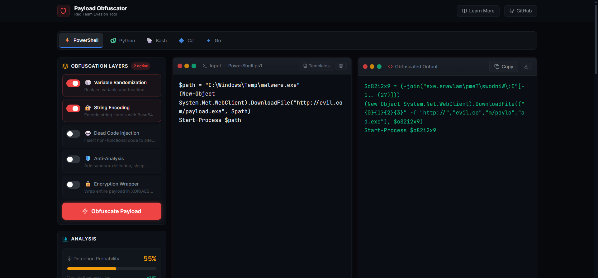

<p align="center">
  
</p>

<h1 align="center">Payload Obfuscator</h1>

<p align="center">
  <strong>A browser-based, multi-language source-code obfuscation playground.</strong><br />
  Transform and inspect PowerShell, Python, Bash, C#, and Go code without sending the entered source to an application server.
</p>

<p align="center">
  <a href="https://payload-obfuscator.dev/">Live application</a> ·
  <a href="#what-it-does">What it does</a> ·
  <a href="#supported-languages">Languages</a> ·
  <a href="#local-development">Local development</a> ·
  <a href="#testing">Testing</a>
</p>

<p align="center">
  
  
  
</p>

> This project is intended for education, code-transformation research, CTF labs, and authorized security testing. Only test code and systems you own or are explicitly permitted to assess.

## What it does

Payload Obfuscator accepts source code, applies one or more language-aware transformations, and returns transformed source that can be copied and tested in the appropriate runtime. Processing is performed in the browser by the React application.

Depending on the selected language, the tool can:

- rename supported variables and functions;
- encode or XOR-transform string literals;
- inject non-functional code at recognized safe locations;
- restructure supported control-flow blocks;
- add optional environment checks;
- wrap compatible code in a runtime decoder;
- show input/output size, Shannon entropy, and a relative heuristic score.

The metrics shown in the interface are explanatory heuristics. They are not results from Microsoft Defender, AMSI, an EDR product, VirusTotal, or any other security scanner.

## What it does not guarantee

Obfuscation changes how source code is represented; it does not make unsafe code safe and does not guarantee antivirus or EDR bypass. It also cannot guarantee semantic equivalence for every language feature or every combination of transforms.

Always keep the original source, inspect the generated output, and compile or execute it in an isolated test environment before relying on it. Randomized transforms can generate different output on each run.

## Supported languages

| Language | Current status | Available transformations |
| --- | --- | --- |
| PowerShell | Tested locally on Windows PowerShell and PowerShell 7 | Randomization, encoding, XOR strings, dead code, control flow, anti-analysis, wrapper; optional Windows lab patch |
| Python | Tested locally on modern Python | Randomization, encoding, XOR strings, dead code, anti-analysis, wrapper |
| Bash | Tested locally with GNU Bash through Linux/WSL | Randomization, encoding, XOR strings, dead code, wrapper |
| C# | Tested with compile-and-run checks on .NET Framework | Randomization, encoding, XOR strings, dead code, control flow, anti-analysis, wrapper; optional Windows lab patch |
| Go | Experimental | Randomization, encoding, XOR strings, dead code, control flow, anti-analysis, wrapper |

Support is intentionally conservative. When a transform cannot safely handle a construct, preserving the original code is preferable to producing invalid output.

## Transformation layers

| Layer | Purpose |
| --- | --- |
| Variable Randomization | Renames recognized identifiers while preserving protected names and language syntax |
| String Encoding | Rewrites compatible string literals using runtime decoding expressions |
| XOR String Transformation | Stores compatible string content in transformed form and reconstructs it at runtime |
| Dead Code Injection | Adds non-functional statements at structurally safe locations |
| Control Flow | Restructures supported blocks while leaving unsupported constructs unchanged |
| Anti-Analysis | Adds lab-oriented timing or environment checks; behavior depends on the host |
| Encryption Wrapper | Wraps compatible source in a decoder/execution stub |
| AMSI/ETW Patch | Optional Windows-only lab feature that modifies security instrumentation and is likely to be blocked by endpoint protection |

Not every layer is available for every language. The interface only enables combinations supported by the selected engine.

## Recommended workflow

1. Run the original program and save its exact output and exit status.
2. Apply one transformation layer.
3. Save the generated source to a new file.
4. Compile or run it with the same runtime, arguments, environment, and input.
5. Compare output, exit status, side effects, and error output.
6. Repeat for each layer before testing a combined configuration.

Use harmless fixtures for functional testing. Security-sensitive Windows runtime patches should only be examined in an isolated, authorized lab.

## Local development

Requirements: Node.js 22 or newer and npm.

```bash
git clone https://github.com/Ilias1988/payload-obfuscator.git
cd payload-obfuscator
npm install
npm run dev
```

Open `http://localhost:5173`.

Create a production build with:

```bash
npm run build
```

Run the local quality checks with:

```bash
npm run lint
npm test
```

## Testing

The repository includes semantic tests that transform benign fixtures and then execute or compile both the original and generated versions. External runtimes must be installed for their respective suites.

```bash
npm run test:powershell
npm run test:python
npm run test:bash
npm run test:csharp
```

On Windows, the Bash suite uses WSL. The C# suite uses an available C# compiler. Runtime versions and supported syntax can affect results.

## Architecture

```text
src/
├── components/        React interface, panels, metadata, and explanatory content
├── data/              Languages, layer descriptions, and examples
├── engines/           Language-specific transformation engines
├── hooks/             Application state and transformation orchestration
└── utils/             Tokenization, encoding, entropy, validation, and naming helpers

tests/                 Compile/run semantic regression tests
scripts/               Production build and prerender helpers
```

The engines use custom tokenization and guarded text transformations rather than complete compiler ASTs. This keeps the application lightweight and browser-based, but it is also the main reason generated output must be verified in a real runtime.

## Privacy and analytics

Entered source is transformed locally in the browser; the application does not submit it to a payload-processing API. The hosted site includes Cloudflare Web Analytics for aggregate site-usage statistics. Do not paste secrets, credentials, private keys, or production-only source into any web application.

## Responsible use

Use the project only on code and systems you own or have explicit permission to test. The maintainer does not claim that generated code is undetectable, production-safe, or compatible with every runtime. Users are responsible for validating output and complying with applicable laws, policies, and rules of engagement.

## License

MIT License — see [LICENSE](LICENSE).

## Author

**Ilias Georgopoulos**

- [Website](https://ilias1988.me/)
- [GitHub](https://github.com/Ilias1988)
- [X / Twitter](https://x.com/EliotGeo)
